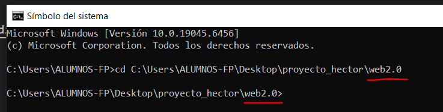

# PROYECTO DE 1ºDAM 🏗

### [Informe](./documentacion/Informe.docx)

### Enlaces
-- [Proyecto de Figma](https://www.figma.com/proto/Y1YnbUeK0Yd82P8Jxwiqij/proyecto)

### Índice
- BASES
    - [Archivo SQL](./bases/proyecto.sql)
    - [Esquema ER](./bases/entidad-relacion.dia)
- PROGRAMACIÓN
    - [Main](./java/proyecto/src/App.java)
- MARCAS
    - [Index](./web2.0/index.html)
- RSS

## Lenguaje de marcas
El apartado de lenguaje de marcas (la web) se creó usando React y por tanto debe ejecutarse en un servidor local de Node.js. Es necesario tener Node.js instalado en el equipo.
Para consultar si tiene Node.js instalado, ejecute el sigiuente comando en command prompt:
`node -vs`

### Instalación y uso de la web
1. Descargar el .zip del repositorio.
2. Extraer el zip.
3. Desde un command prompt (recomendado el de vscode), ubicarse en el directorio "web2.0".

4. Ejecutar el siguiente comando:
`npm run dev`
5. Hacer click en el enlace que aparece en el cmd. Si no deja hacer click, puede copiar y pegar el enlace en su navegador.

### Funcionamiento de la web
Haga click [aquí](./funcionamiento_web.md) para ver la documentación del funcionamiento de la web.