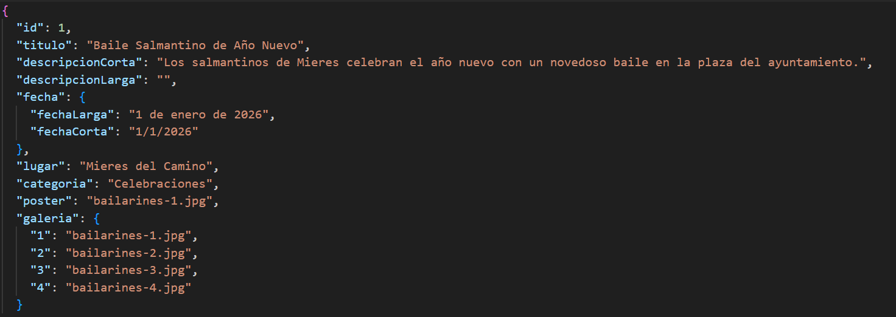
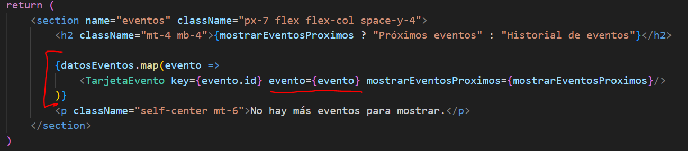
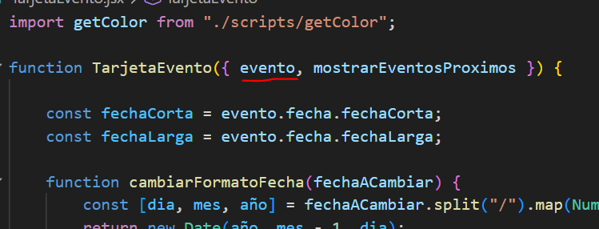
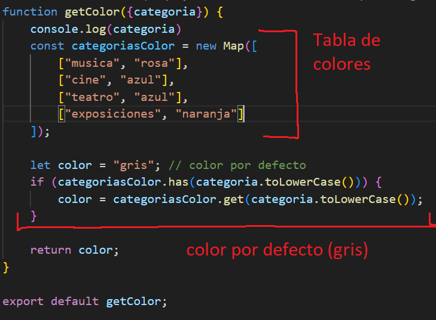

# FUNCIONAMIENTO DE LA WEB
En este documento se dejará claro cómo funciona la web desde el punto de vista de un desarrollador web.

## Índice

## ¿Por qué React?

## Archivo JSON
Los eventos disponibles, lo cuales corresponden a los del apartado de bases de datos, 
son registrados en un archivo JSON para evitar redundancia de componentes (no tener que crear un archivo html para cada evento).

El JSON está compuesto por objectos, cada uno representando un evento. Cada evento tiene las siguientes propiedades:

La propiedad "galería" puede ser en algunos caso "null" si el evento aún no tiene una. Lo mismo se aplica al poster, en cuyo caso se usará una imagen temporal.

## Sistema de eventos
Al entrar a cualquier página de la web que muestre eventos, la web hace un bucle iterando por cada evento en el JSON. La función le 
pasa el evento junto a sus atributos al componente necesario para que él muestre la información del evento.

#### Ejemplo
Para las tarjetas de evento, la web lee los eventos uno por uno y llama al componente "TarjetaEvento" uno por uno, pasándole 3 parámentros, uno de ellos siendo el objeto evento.

El componente recibe el parámetro del evento. Este es un objeto que contiene todas las propiedades disponibles del archivo JSON.

### Colores dinámicos
Para mostrar el color característico del evento (el cual depende de la categoría), la web lee la propiedad de "categoría" en el evento, y
dependiendo de cúal es, se le asignará un color. Para lograr esto, existe una función JavaScript que devuelve un color dependiendo de la categoría dada.

Este sistema aporta una gran facilidad a la hora de crear eventos nuevos.